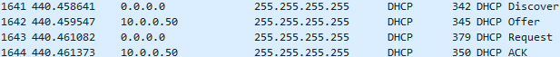
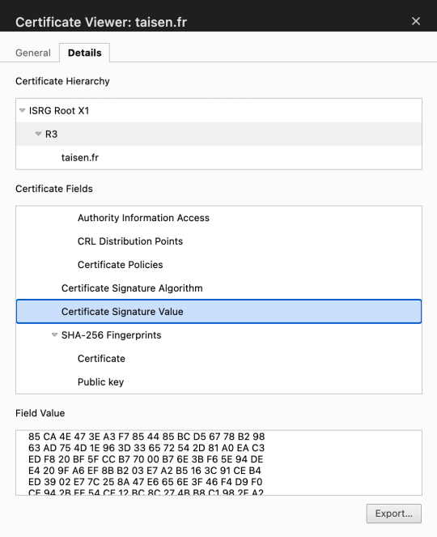
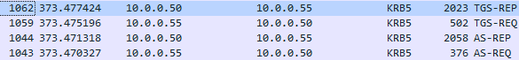
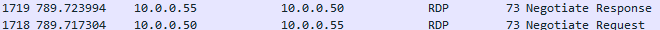
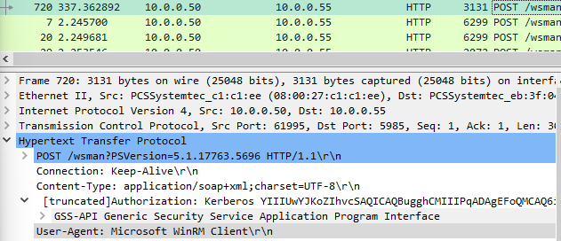
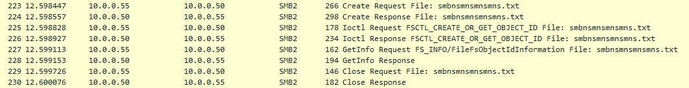
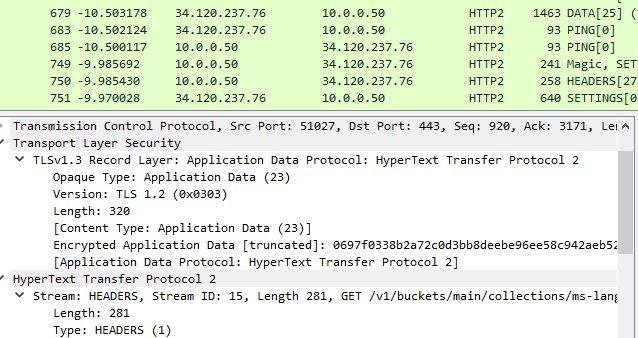

# Rappels

L'adresse IP de notre serveur est la suivante : `10.0.0.50`. Il s'agit par conséquent d'une adresse de classe A :

    

Son masque de sous-réseau est en /24 : `255.255.255.0` :

    

L'adresse de notre passerelle est la suivante : `10.0.0.254` : 

    

# Questions

## 0. Quels sont les flags TCP ?
   Les flags TCP sont des indicateurs dans l'en-tête d'un segment TCP qui contrôlent diverses fonctions de la connexion. Les principaux flags TCP sont les suivants : 
  
  -  SYN (Synchronize) : Utilisé pour initier une connexion.
  
   - ACK (Acknowledgment) : Indique l'accusé de réception d'un segment précédent.
  
  -  FIN (Finish) : Utilisé pour terminer une connexion.
  
  -  RST (Reset) : Réinitialise une connexion défaillante ou incorrecte.
  
  -  PSH (Push) : Demande une transmission immédiate des données.
   
  -  URG (Urgent) : Signale que des données urgentes sont présentes et doivent être traitées en priorité.

## 1. Capturer le processus DORA du protocle DHCP

    

## 2. Qu’est ce que le DHCP Starvation / snooping ? Rogue DHCP ?

Le DHCP Starvation est une attaque où un attaquant inonde le serveur DHCP avec de nombreuses demandes de location d'adresses IP. Cela épuise les ressources du serveur DHCP et peut entraîner un refus de service pour les clients légitimes.

Un Rogue DHCP est un serveur DHCP malveillant mis en place sur un réseau sans autorisation. Il distribue des adresses IP aux clients du réseau et peut être utilisé pour rediriger le trafic vers des serveurs contrôlés par l'attaquant. Cela peut entraîner divers problèmes de sécurité et de fonctionnement du réseau.

## 3. Que se passe-t-il lors du `ipconfig /release` ? D’un point de vue sécurité quel peut etre l'enjeu ?

Lorsque l'on exécute `ipconfig /release`, l'ordinateur envoie un message au serveur DHCP pour libérer son adresse IP actuelle. L'enjeu sécuritaire réside dans le risque d'abus de cette commande par des attaquants qui pourraient potentiellement perturber le réseau en libérant de manière répétée des adresses IP, causer des problèmes de disponibilité des services ou même tenter des attaques de type "man-in-the-middle".

## 4. Quelle fonctionnalité propose CISCO pour se prémunir des attaques DHCP ?

Cisco propose une fonctionnalité appelée "DHCP Snooping" pour se prémunir des attaques DHCP. Cela permet de surveiller et de contrôler le trafic DHCP sur un réseau, en détectant et en bloquant les serveurs DHCP non autorisés, ce qui renforce la sécurité du réseau.

## 5. Capturer une requête DNS et sa réponse

    

    

## 6. Qu'est-ce que le DNS Spoofing ?

Le DNS Spoofing est une technique où un attaquant falsifie les informations de réponse DNS pour rediriger le trafic légitime vers des serveurs malveillants. 

Pour s'en protéger, on peut :
- Configurer des pare-feu pour limiter l'accès aux serveurs DNS uniquement aux sources fiables.
- Utiliser des logiciels antivirus et anti-malware pour détecter les logiciels malveillants qui pourraient être utilisés dans des attaques de DNS Spoofing.
- Utiliser des VPN ou d'autres solutions de chiffrement pour sécuriser les communications DNS.
- Mettre à jour régulièrement les systèmes et applications pour corriger les vulnérabilités connues qui pourraient être exploitées dans des attaques de DNS Spoofing.

## 7. Qu’est-ce que DNS Sec ? DNS over TLS / HTTPS ?

DNSSEC (Domain Name System Security Extensions) est une extension de sécurité du DNS qui vise à garantir l'authenticité et l'intégrité des données DNS en utilisant des signatures cryptographiques.

DNS over TLS et DNS over HTTPS sont des méthodes de sécurisation des requêtes DNS visant à chiffrer les communications entre le client et le serveur DNS. Cela empêche les attaquants d'intercepter ou de modifier les requêtes DNS, améliorant ainsi la confidentialité et la sécurité des données de navigation.

## 8. Dans quels cas trouve-t-on du DNS sur TCP

Le DNS utilise généralement le protocole UDP (User Datagram Protocol) pour les requêtes et les réponses, mais dans certains cas où la taille des données DNS dépasse la limite de 512 octets, il peut basculer vers le protocole TCP (Transmission Control Protocol).

## 9. Capturer un flux HTTP

    

## 10. Qu’est-ce que le HTTP Smuggling ? Donner un exemple de CVE

Le HTTP Smuggling est une attaque qui exploite des divergences entre les implémentations de proxy ou de pare-feu pour manipuler le traitement des en-têtes HTTP, permettant ainsi à un attaquant de contourner les mécanismes de sécurité et d'exécuter des attaques telles que l'injection de contenu malveillant ou la falsification de requêtes.

Comme exemple de CVE lié au HTTP Smuggling, on peut citer [CVE-2024-1135](https://nvd.nist.gov/vuln/detail/CVE-2024-1135).

## 11. Comment mettre en place la confidentialité et l'authenticité pour HTTP ?

Pour mettre en place la confidentialité et l'authenticité pour HTTP, on peut utiliser HTTPS (Hypertext Transfer Protocol Secure). HTTPS utilise le chiffrement SSL/TLS pour sécuriser les communications entre le client et le serveur. Cela garantit la confidentialité des données en les chiffrant pendant la transmission et assure l'authenticité du serveur en utilisant des certificats numériques.

## 12. Qu’est-ce qu’une PKI ?

Une PKI (Public Key Infrastructure) est un ensemble de politiques, procédures et technologies utilisées pour gérer les certificats numériques et les clés publiques/privées. Elle fournit un cadre sécurisé pour la distribution et la gestion des certificats numériques, ainsi que pour la vérification de l'identité des parties impliquées dans les transactions en ligne. La PKI permet donc d'assurer l'authenticité, l'intégrité et la confidentialité des données échangées sur les réseaux informatiques.

## 13. Capturer un mot de passe HTTP ou FTP ou Telnet (mettre en place les services si nécessaire)

    

## 14. Comment mettre en place la confidentialité pour ce service ?

- Utiliser FTPS : configurer le serveur FTP pour utiliser SSL/TLS. Obtenir ou générer un certificat SSL.
- Utiliser SFTP : s'assurer que SSH est configuré et que les utilisateurs peuvent se connecter via SFTP.
- Configurer les permissions et l'accès : limiter les permissions des fichiers et répertoires. 
- Utiliser des comptes utilisateurs spécifiques et des groupes pour gérer l'accès.
- Utiliser un pare-feu et filtrage IP : configurer des règles de pare-feu pour restreindre l'accès au serveur FTP à des IP spécifiques.

## 15. Capturer un handshake TLS

    

## 16. Qu’est-ce qu’une autorité de certification (AC) racine ? Qu'est qu'une AC intermediaire ?

Une Autorité de Certification (AC) racine est une autorité de certification de premier niveau dans une infrastructure à clés publiques (PKI). Elle émet des certificats de confiance pour d'autres autorités de certification, garantissant ainsi la confiance dans les certificats qu'elles émettent. Les certificats racines sont souvent préinstallés dans les logiciels et les systèmes d'exploitation pour établir une chaîne de confiance.

Une Autorité de Certification intermédiaire (AC intermédiaire) est une autorité de certification qui se situe entre l'AC racine et les entités finales, telles que les serveurs Web ou les clients. Les AC intermédiaires émettent des certificats de serveur et de client au nom de l'AC racine, étendant ainsi la portée de la PKI tout en maintenant la confiance dans les certificats émis. Les certificats intermédiaires sont souvent utilisés pour des raisons de sécurité et de gestion, permettant à l'AC racine de rester hors ligne pour une protection accrue.

## 17. Connectez-vous sur https://taisen.fr et affichez la chaine de confiance du certificat

    

## 18. Capturer une authentification Kerberos (mettre en place le service si nécessaire)

    

## 19. Capturer une authentification RDP (mettre en place le service si nécessaire)

    

## 20. Quelles sont les attaques connues sur NetLM ?

Les attaques connues sur NetLM sont les suivantes : 

- Pass-the-Hash (PTH) : l'attaquant peut capturer les hachages de mots de passe NetLM stockés localement sur un système compromis et les utiliser pour s'authentifier sur d'autres systèmes du réseau sans connaître réellement le mot de passe d'origine. Cette attaque est rendue possible car NetLM stocke les hachages de mots de passe plutôt que les mots de passe en clair.
- Rainbow Tables : les hachages de mots de passe NetLM étant vulnérables (*aspect trop technique pour moi pour l'instant pour détailler ces vulnérabilités*), les attaquants peuvent précalculer les hachages de mots de passe les plus courants et comparer les hachages capturés pour trouver des correspondances.
- Attaques par force brute : l'attaquant essaie de deviner le mot de passe en essayant différentes combinaisons de caractères jusqu'à ce qu'il trouve le bon hachage.
- Attaques d'usurpation de session : les attaquants peuvent capturer les hachages de mots de passe NetLM et les utiliser pour s'authentifier en tant qu'utilisateur légitime, ce qui leur permet d'usurper la session de l'utilisateur et d'accéder à des ressources sensibles.

## 21. Capturer une authentification WinRM (Vous pouvez utiliser EvilWinRM si nécessaire côté client.)

    

## 22. Capturer une authentification SSH ou SFTP (mettre en place le service si nécessaire)

    

## 23. Intercepter un fichier au travers du protocole SMB

    

## 24. Comment proteger l'authenticité et la confidentialité d'un partage SMB ?

Pour protéger l'authenticité et la confidentialité d'un partage SMB, on peut :

- Utiliser des connexions sécurisées : configurer les clients et les serveurs SMB pour qu'ils utilisent des connexions sécurisées telles que SMB sur VPN (Virtual Private Network) ou SMB sur SSL/TLS.
- Mettre en place des politiques d'accès strictes : autorisations d'accès appropriées pour contrôler qui peut accéder aux partages SMB et quelles actions peuvent être effectuées.
- Surveiller et auditer le trafic SMB : surveillance régulière du trafic SMB pour détecter les activités suspectes et les tentatives d'attaque.

## Bonus 1 :  Déchiffrer le trafic TLS avec votre certificat et/ou votre clé de session

    

