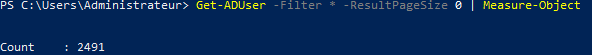

# Vérification des intégrités des images téléchargées avant l'installation

Le but est ici d'obtenir le hash d'un iso déjà téléchargé et de le comparer avec le hash officiel. On a la confirmation que notre hash est correct : 

    

# Statut des services DNS et Web

On vérifie que le service DNS est fonctionnel via le Gestionnaire DNS de notre serveur : 

    

Il faut également observer le statut du service web, pour ce faire on utilise l'adresse localhost, port 3000 ou 4000 : 

    

# Connexions SSH et WinRM

Afin de prendre la main sur notre Debian et notre client Windows, on installe les services SSH et WinRM. SSH a été installé de base lors de l'installation de notre Debian et WinRM grâce à `winrm quickconfig` qui est une méthode un peu plus historique comparée à `Enable-PSRemoting` : 

    

    

# Permissions et statut du partage SMB

On configure un partage SMB, un RO et un RW : 

    

    

On peut faire un test et vérifier qu'il est impossible de modifier un fichier dans le partage Read-Only : 

    

# Nombre d'utilisateurs contenus dans l'AD

Le but du lab était finalement l'exécution du script badblood: `. ./invoke-badblood.ps1` qui consiste à "envahir" l'AD. Afin de vérifier que BadBlood est correctement passé, on vérifie le nombre d'utilisateurs dans l'AD : 

    

