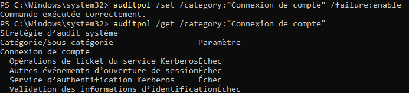
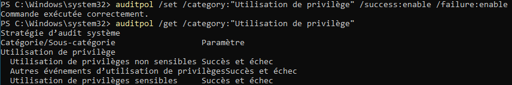
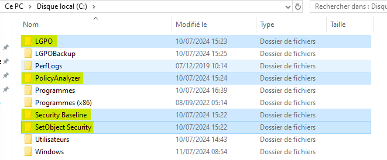
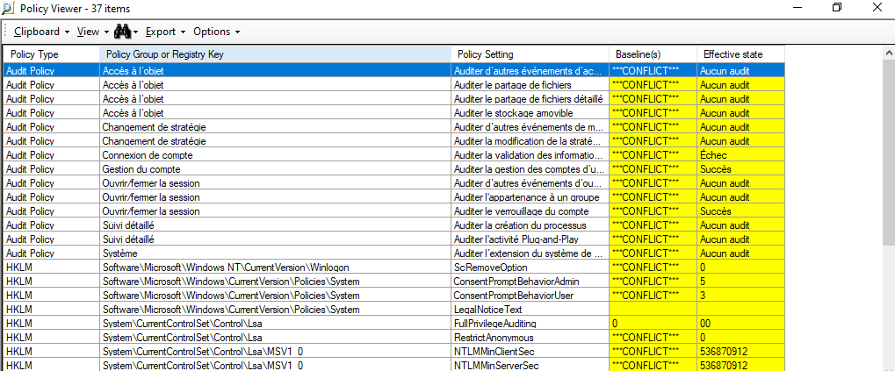
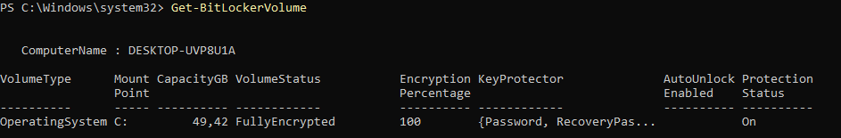
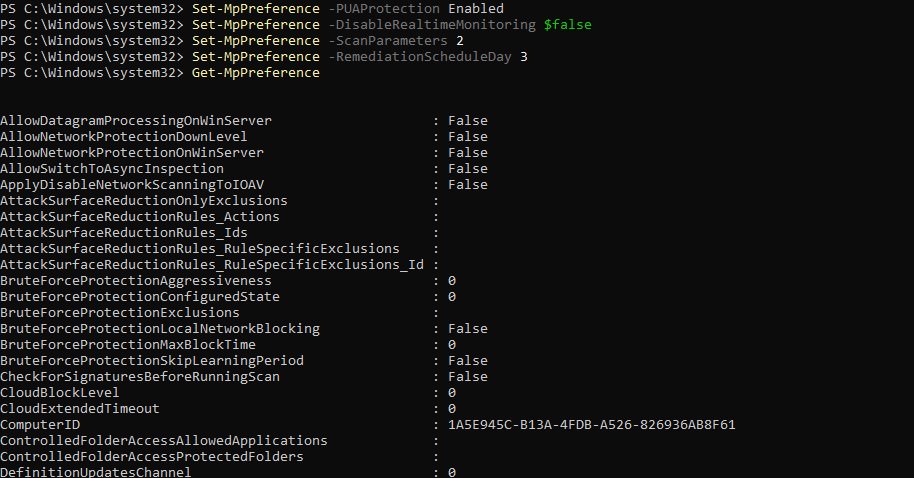

# Préambule 

Installation d'une Machine Windows (VM) cliente non-jointe à l'Active Directory.

# Questions

## Configurer auditpol pour logger les erreurs d'authentification et les escalades de privilèges puis prouver la bonne configuration d'auditpol en retrouvant les evenements dans les logs.

    

    

## Lire la documentation Microsoft Security Compliance Toolkit et télécharger la version correspondante à vote OS.
https://learn.microsoft.com/fr-fr/windows/security/operating-system-security/device-management/windows-security-configuration-framework/security-compliance-toolkit-10

    

## Se documenter sur LGPO et comparer votre GPO actuelle à celle recommandée grace à PolicyAnalyzer.

    

## Activer le chiffrement de surface (bitlocker recommandé)

    

## Renforcer la configuration Antivirus à l'aide de powershell

    

## Votre configuration Auditpol initiale est elle persistante ? Pourquoi ?

Non, car la GPO est prioriaire sur auditpol. En effet, la configuration d'auditpol n'est pas persistante par défaut : elle ne survit pas aux redémarrages. Pour que la configuration soit persistante, il faudrait par exemple utiliser des GPO pour appliquer les paramètres à chaque démarrage ou bien exécuter un script au démarrage qui applique les paramètres souhaités. 