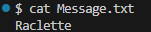
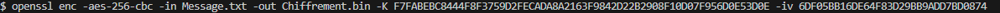
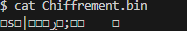
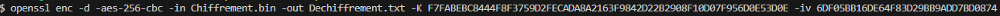
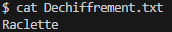
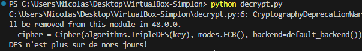

# Questions

## Donner les algorithmes les plus réputés et barrer ceux qui ne devraient plus être utilisés en expliquant pourquoi.

- AES 256 avec mécanisme XTS
  
- **~~AES 128 avec ECB~~** : mode ECB ne fournit pas de randomisation.
  
- **~~3DES~~** : trop petite taille de clé et performances faibles. Migration vers AES recommandée.
  
- SHA2
  
- **~~SHA1~~** : vulnérable aux attaques par collision. Passage à SHA2 voire SHA3 recommandé. 
  
- **~~MD5~~** : obsolète, vulnérable aux attaques par collision. 
  
- RSA avec OAEP
  
- **~~RSA avec PKCS1~~** : vulnérable aux attaques par chevauchement de paquets. Migration vers OAEP recommandée. 

## Comment générer une clé de chiffrement de manière sure ? Quel est le risque si les IV sont toujours les mêmes ?

Pour garantir la sécurité de la clé de chiffrement, il est important de la générer de manière aléatoire et sécurisée. On peut, par exemple, utiliser OpenSSL pour générer une clé. Parmi les risques associés à l'utilisation de IVs identiques, on peut compter la révélation de patterns, les attaques par texte chiffré, le manque de diversité dans le chiffrement... 


##  Générer une clé de chiffrement AES256 ainsi que les IV avec le destinataire. Partagez-la avec votre destinataire en essayant de préserver sa confidentialité.

```bash
openssl enc -aes-256-cbc -k test_mdp -P -md sha256
```

## Chiffrer le message

```bash
openssl enc -aes-256-cbc -in Message.txt -out Chiffrement.bin -K [insérer key number] -iv [insérer iv number]
```

## Déchiffrer le message 

```bash
openssl enc -d -aes-256-cbc -in Chiffrement.bin -out Dechiffrement.txt -K [insérer key number] -iv [insérer iv number]
```

### Procédure complète
<p align="center">
    
</p>

<p align="left">
    
</p>

<p align="center">
    
</p>

<p align="left">
    
</p>

<p align="left">
    
</p>

<p align="left">
    
</p>

## Le message suivant a été intercepté: "prggr grpuavdhr f'nccryyr yr puvsserzrag qr prnfre, vy a'rfg cyhf hgvyvft nhwbheq'uhv, pne crh ftphevft", il semble vulnérable à une attaque en fréquences ou une attaque par force brute. Déchiffrez-le !

Il existe des outils pour déchiffrer les messages de ce genre, voir par exemple https://www.dcode.fr/chiffre-cesar.
Ainsi, le message une fois déchiffré donne : "cette technique s'appelle le chiffrement de césar, il n'est plus utilisé aujourd'hui, car peu sécurisé".

## Trouver ce qui ne convient pas dans le chiffrement de ces messages.

```txt
Bob: '>s\x06\x14\x0c\xa7\xa6\x88\xd5[+i\xcc/J\xf7'
Alice: "3\x01\xeb\xcah\xf6\x1f\xc2[\xf9}P'A\xe0\xd5"
Bob: '\xf7\xb0\xc5\xccO\xab&\xee\xa4&6N?V\xbd\x85\x94b\xee\xc5\x18\x1f9\xe7\xe5\xe0\xffyf\xab\xfb\xb9
Alice: '\xde@=\x1ed\xc0Qe\x0fK=\x1c\xb3$\xd9\xcb'
Bob: '\xce\xbf\x0e\\\x8aX\x1c \xb2v\x97\xf5<\x86M\x86\x0c\xa1j\xa0\xe6\xa9\x11\xf9AyZ\xda9\x94ec'
Alice: "\xde@=\x1ed\xc0Qe\x0fK=\x1c\xb3$\xd9\xcb"
Bob: '\xfb\x0cc\xb0/\xd4:\xde\xe7a\x95_L\x8d\x108\xac\xff\xcep\x8e&\xcfq6ym\x0c\xf6\xccI\xed'
Alice: '\xee\xcb\xd0\x9aRt;\x12\xca\xfe\r\x01MN>\xde'
Bob: '\xab\x8aX\xef\xd4\xf3\x88a\x1a\x96\r\xec\x17\xe6s"\x94\xec6\xe0\xff \x82\xa1\xb4\xe2\xc1\x08\r!T\x89\xe2B\x1d^\xf7l\xd8\xc9\xa4\xcd\xa5\x8e\xb3\x1d\x1f\xe7'
Alice: '\xee\xcb\xd0\x9aRt;\x12\xca\xfe\r\x01MN>\xde'
Alice: '\x1f\xafV4\xcb\x116N\xc5.\xa8\xdfM\xcf\xda\x02\x98\xbb\x04\x04C}N{\xf95\x05e\xc6\xf9\xbe,'
Bob: '\xde@=\x1ed\xc0Qe\x0fK=\x1c\xb3$\xd9\xcb'
```

Les messages d'Alice contiennent plusieurs fois le même texte chiffré `'\xde@=\x1ed\xc0Qe\x0fK=\x1c\xb3$\xd9\xcb'`. Ce texte devrait être différent à chaque chiffrement avec un IV différent. La réutilisation du même bloc chiffré avec la même clé et IV peut indiquer une réutilisation de la clé ou de l'IV, ce qui est un signe de problème potentiel. En outre, certains messages semblent être de longueur différente, ce qui pourrait être dû par exemple à une erreur de padding. 

## Interception d'un message
Le message intercepté est le suivant : `b'\xd72U\xc03.\xda\x99Q\xb5\x020\xc4\xb8\x16\xc6\xfa-\xb9U+\xda\\\x126L\xf3~\xbd8\x12q\x02?\x80\xeaVI\xa9\xe1'`

La première partie de la clé de 16 octets est: `b'12345678bien'`. Si on désire utiliser la méthode du "guessing", on devine que les 4 derniers octets correspondent à "joue" et donc on adapte notre script : 

```python
from cryptography.hazmat.primitives.ciphers import Cipher, algorithms, modes
from cryptography.hazmat.primitives import padding
from cryptography.hazmat.backends import default_backend

def des_decrypt(key, ciphertext):
    cipher = Cipher(algorithms.TripleDES(key), modes.ECB(), backend=default_backend())
    decryptor = cipher.decryptor()
    pt = decryptor.update(ciphertext) + decryptor.finalize()
    unpadder = padding.PKCS7(64).unpadder()
    unpadded_data = unpadder.update(pt) + unpadder.finalize()
    return unpadded_data

# Clé complète
key = b'12345678bienjoue'

# Message intercepté
ciphertext = b'\xd72U\xc03.\xda\x99Q\xb5\x020\xc4\xb8\x16\xc6\xfa-\xb9U+\xda\\\x126L\xf3~\xbd8\x12q\x02?\x80\xeaVI\xa9\xe1'

# Déchiffrement du message
message_dechiffre = des_decrypt(key, ciphertext)

print(message_dechiffre.decode('utf-8'))
```

<p align="left">
    
</p>

On peut aussi utiliser le bruteforce :

```python
from cryptography.hazmat.primitives.ciphers import Cipher, algorithms, modes
from cryptography.hazmat.primitives import padding
from cryptography.hazmat.backends import default_backend

def des_decrypt(key, ciphertext):
    cipher = Cipher(algorithms.TripleDES(key), modes.ECB(), backend=default_backend())
    decryptor = cipher.decryptor()
    pt = decryptor.update(ciphertext) + decryptor.finalize()
    unpadder = padding.PKCS7(64).unpadder()
    unpadded_data = unpadder.update(pt) + unpadder.finalize()
    return unpadded_data

ciphertext = b'\xd72U\xc03.\xda\x99Q\xb5\x020\xc4\xb8\x16\xc6\xfa-\xb9U+\xda\\\x126L\xf3~\xbd8\x12q\x02?\x80\xeaVI\xa9\xe1'

partial_key = b'12345678bien'

def find_key():
    characters = "abcdefghijklmnopqrstuvwxyz"

    for c1 in characters:
        for c2 in characters:
            for c3 in characters:
                for c4 in characters:
                    yield c1 + c2 + c3 + c4

# Essayer toutes les combinaisons possibles
for key_suffix in find_key():
    key = partial_key + key_suffix.encode()  # Convertir la combinaison en bytes

    try:
        decrypted_message = des_decrypt(key, ciphertext)
        # Tentative de décodage en tant que texte UTF-8
        try:
            decoded_message = decrypted_message.decode('utf-8')
            print(f"Key: {key_suffix} - Decrypted Message: {decoded_message}")
        except UnicodeDecodeError:
            # Ignorer les messages qui ne sont pas valides en UTF-8
            continue
    except Exception as e:
        # Ignorer les erreurs liées aux clés incorrectes
        continue
```

<p align="left">
    
</p>