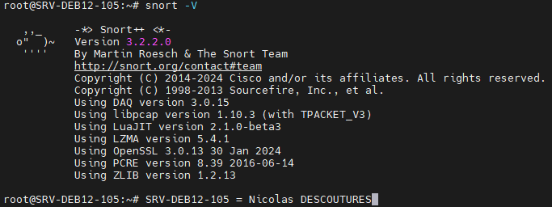

*Les manipulations sont effectuées en root.*

# Mise à jour des paquets de base
```bash
apt update
apt upgrade
```

# Installation des paquets requis 
```bash 
apt install -y build-essential autotools-dev libpcre3 libpcre3-dev libpcap-dev libdumbnet-dev bison flex zlib1g-dev libluajit-5.1-dev liblzma-dev libssl-dev pkg-config hwloc libhwloc-dev cmake git
```

# Installation de Snort
```bash
git clone https://github.com/snort3/snort3.git
cd /root/snort3
mkdir build
```

# Installation et configuration de Libdaq
```bash
cd /root
git clone https://github.com/snort3/libdaq.git 
cd libdaq 
./bootstrap
./configure
make
sudo make install
ldconfig
```

# Définir les chemins des bibliothèques
```bash
export LD_LIBRARY_PATH=/usr/local/lib:$LD_LIBRARY_PATH 
export PKG_CONFIG_PATH=/usr/local/lib/pkgconfig:$PKG_CONFIG_PATH 
```

# Finalisation de l'installation de Snort
```bash
cd /root/snort3/build
cmake ..
make
```

# Vérifier la configuration
```bash

si root : ls /root/snort3/build/src/snort
si pas root : ls /usr/local/bin/snort 
```

# Fin
```bash
sudo make install	
snort -V
```
<p align="center">
    
</p>