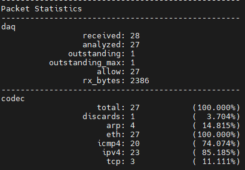

# Configuration de la carte réseau

## Activation du mode promiscuous

```bash
ip link set dev ens18 promisc on 
```

## Configuration de l'offload

```bash
ip ink show ens18
apt install ethtool
ethtool -k ens18 |grep receive-offload
ethtool -K ens18 gro off lro off
ethtool -k ens18 | grep receive-offload
```

# Configuration du paramétrage automatique de la NIC en tant que service

## Création du fichier de service

```bash
nano /etc/systemd/system/snort3-nic.service
```

## Contenu du fichier

```bash
[Unit]
Description=Set Snort 3 NIC in promiscuous mode and Disable GRO, LRO on boot
After=network.target

[Service]
Type=oneshot
ExecStart=/usr/sbin/ip link set dev ens18 promisc on
ExecStart=/usr/sbin/ethtool -K ens18 gro off lro off
TimeoutStartSec=0
RemainAfterExit=yes

[Install]
WantedBy=default.target
```

## Activation et redémarrage du service

```bash
systemctl daemon-reload
systemctl start snort3-nic.service
systemctl enable --now snort3-nic.service
```

# Création d'un fichier de règles personnalisées 

## Création du fichier de règles

```bash
nano snort3/rules/local.rules
```

## Contenu du fichier

```bash
# ----------------
# LOCAL RULES
# ----------------
# This file intentionally does nots come with signatures. Put your local additions here.

alert icmp any any -> any any (msg:"!!! ICMP Alert !!!";sid:1000001;rev:1;classtype:icmpevent;)
```

# Configuration des logs

## Création du répertoire

```bash
mkdir /var/log/snort
chmod 777 /var/log/snort
```

## Modification du fichier de configuration de Snort

```bash
nano snort3/lua/snort.lua
```
## Modification à apporter au fichier 

```bash
---------------------------------------------------------------------------
-- 7. configure outputs
---------------------------------------------------------------------------

alert_fast =
{
    file = true,
    limit = 100000
}

alert_full =
{
    file = true,
    limit = 100000
}
```

## Lancer la capture Snort

```bash
snort -c snort3/lua/snort.lua -R snort3/rules/local.rules -i ens18 -A alert_fast -l /var/log/snort
```

<p align="center">
    
</p>

<p align="center">
    
</p>