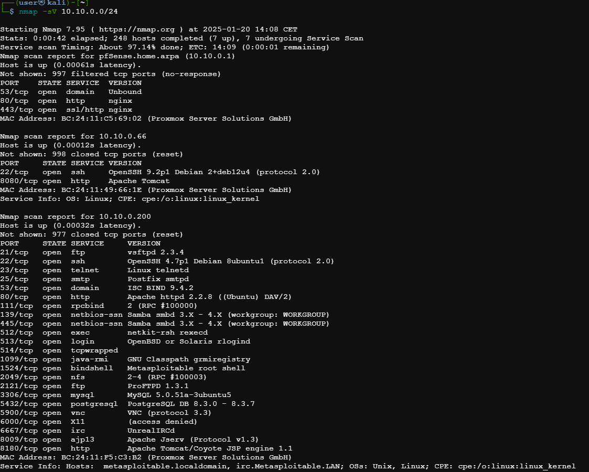

# Préparation du pentest sur la machine Metasploit 2

## Scan du réseau pour identifier les machines et les ports ouverts

    

La machine Metasploit 10.10.0.200 est identifiée ci-dessus.

## Rapport de Scan Nmap - Hôte 10.10.0.200

### Informations Générales

- **Hôte actif** : Oui (latence de 0.00032s)
- **Adresse MAC** : BC:24:11:F5:C3:B2 (Proxmox Server Solutions GmbH)
- **Nom d'hôte** : metasploitable.localdomain, irc.Metasploitable.LAN
- **Systèmes d'exploitation détectés** : Unix, Linux
- **CPE** : cpe:/o:linux:linux_kernel

### Résumé des Ports Ouverts

#### Port 21 (FTP)
- **Service** : vsftpd 2.3.4  
- **Description** : Serveur FTP.  
- **Vulnérabilité** : Cette version est connue pour une vulnérabilité permettant l'exécution de code à distance.

#### Port 22 (SSH)
- **Service** : OpenSSH 4.7p1 Debian 8ubuntu1 (protocole 2.0)  
- **Description** : Service SSH utilisé pour les connexions sécurisées à distance.  
- **Vulnérabilité** : Cette version est obsolète et pourrait comporter des vulnérabilités non corrigées.

#### Port 23 (Telnet)
- **Service** : Linux telnetd  
- **Description** : Service Telnet utilisé pour les connexions à distance non sécurisées.  
- **Vulnérabilité** : Telnet transmet des informations en clair, ce qui le rend vulnérable aux attaques par interception.

#### Port 25 (SMTP)
- **Service** : Postfix smtpd  
- **Description** : Serveur de messagerie utilisé pour l'envoi d'e-mails.  
- **Vulnérabilité** : Aucune vulnérabilité spécifique identifiée dans cette version, mais le service peut être exploité pour le spam si mal configuré.

#### Port 53 (DNS)
- **Service** : ISC BIND 9.4.2  
- **Description** : Serveur DNS utilisé pour la résolution de noms de domaine.  
- **Vulnérabilité** : Les versions anciennes de BIND sont connues pour diverses vulnérabilités exploitables à distance.

#### Port 80 (HTTP)
- **Service** : Apache httpd 2.2.8 (Ubuntu) DAV/2  
- **Description** : Serveur web hébergeant des pages HTTP.  
- **Vulnérabilité** : Cette version d'Apache est obsolète et peut être vulnérable aux attaques par débordement de tampon ou inclusion de fichiers.

#### Port 111 (RPCBIND)
- **Service** : Version 2 (RPC #100000)  
- **Description** : Permet la gestion des services RPC (Remote Procedure Call).  
- **Vulnérabilité** : La mauvaise configuration ou l'exploitation de RPC peut donner lieu à une prise de contrôle à distance.

#### Port 139/445 (NetBIOS-SSN)
- **Service** : Samba smbd 3.X - 4.X (workgroup: WORKGROUP)  
- **Description** : Protocole de partage de fichiers et d'imprimantes sur le réseau.  
- **Vulnérabilité** : Certaines versions de Samba permettent une exécution de code à distance via des vulnérabilités connues.

#### Port 1524 (Bindshell)
- **Service** : Metasploitable root shell  
- **Description** : Shell root préconfiguré pour des tests d'exploitation.  
- **Vulnérabilité** : Ce port représente un accès direct à un shell root et doit être désactivé pour éviter une compromission.

#### Port 3306 (MySQL)
- **Service** : MySQL 5.0.51a-3ubuntu5  
- **Description** : Serveur de base de données.  
- **Vulnérabilité** : Les versions anciennes de MySQL peuvent être vulnérables à des attaques par injection SQL ou par contournement d'authentification.

#### Port 5432 (PostgreSQL)
- **Service** : PostgreSQL 8.3.0 - 8.3.7  
- **Description** : Serveur de base de données relationnelle.  
- **Vulnérabilité** : Cette version est obsolète et pourrait comporter des vulnérabilités connues.

#### Port 6667 (IRC)
- **Service** : UnrealIRCd  
- **Description** : Serveur de chat basé sur le protocole IRC.  
- **Vulnérabilité** : Certaines versions d'UnrealIRCd ont été compromises avec des portes dérobées (backdoors) intégrées.

### Recommandations
- **Mettre à jour les services vulnérables** : Les versions de **vsftpd**, **OpenSSH**, et **Samba** doivent être mises à jour pour éliminer les vulnérabilités connues.
- **Restreindre l'accès aux services sensibles** : Il est conseillé de désactiver ou de sécuriser avec des mécanismes d'authentification forts des services comme **Telnet**, **FTP**, et **rlogin**, qui transmettent des informations en clair.
- **Configurer un pare-feu** : Limiter l'accès aux ports sensibles, notamment **21 (FTP)**, **22 (SSH)**, et **80 (HTTP)**, selon les besoins réels.

---
*Rapport généré à partir d'un scan Nmap effectué sur l'hôte 10.10.0.200.*