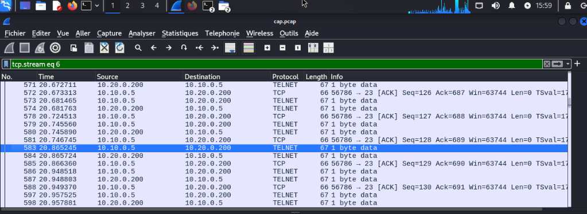
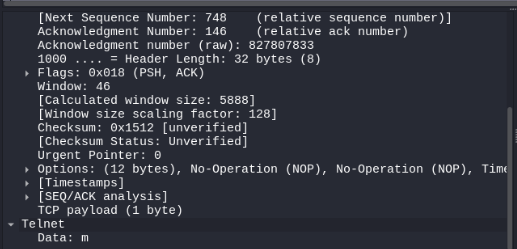

# Capture du trafic

## Lancement d'un tcpdump sur l'interface

Sur le serveur Suricata : 
```bash
tcpdump -i ens19 -w cap.pcap
```

## Connexion Telnet depuis la machine Kali Linux

```bash
telnet 10.20.0.200
```

## Copie du .pcap vers la machine Kali Linux 

```bash
scp cap.pcap user@10.10.0.5:/home/user
```

## Observation via Wireshark

Sur la machine Kali, aller dans l'explorateur de fichiers, ouvrir le fichier .pcap et appliquer le filtre idoine : 

<p align="center">
    
</p>

En observant des paquets, on peut reconstituer le mot de passe :

<p align="center">
    
</p>