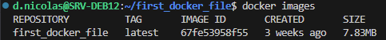
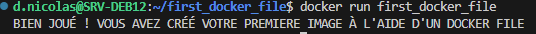

# Installation 

### Mise à jour des paquets

```bash
sudo apt-get update
```

### Installation des prérequis

```bash
sudo apt-get install apt-transport-https ca-certificates curl gnupg2 software-properties-common
```

### Ajout du repository de Docker

Ajout de la clé GPG du dépôt officiel de Docker. Permet au gestionnaire de paquets apt de vérifier l'authenticité des packages téléchargés depuis ce dépôt.

```bash
curl -fsSL https://download.docker.com/linux/debian/gpg | sudo apt-key add -
```

Ajout du dépôt 

```bash
sudo add-apt-repository "deb [arch=amd64] https://download.docker.com/linux/debian $(lsb_release -cs) stable"
```

Mise à jour des paquets

```bash
sudo apt update
```

### Installation des composants de Docker

```bash
sudo apt-get install docker-ce docker-ce-cli containerd.io
```

### Configuration des autorisations

S'assurer de la création du groupe docker

```bash
sudo groupadd docker
```

Ajout de l'utilisateur au groupe docker 

```bash
sudo usermod -aG docker ncls.d
```

Changement du groupe primaire de l'utilisateur pour la session actuelle (évite d'avoir à se déconnecter et reconnecter à la session)

```bash
newgrp docker
```

### Configuration des services

```bash
sudo systemctl enable docker.service
sudo systemctl enable containerd.service
```

# Premières commandes

## Docker Hub

Créer un compte sur le docker hub : https://hub.docker.com/ et lancer la commande suivante depuis la machine exécutant Docker :

```bash
docker login
```

## Test de commandes et Hello World

```bash
docker images
docker ps
docker run hello-world
docker images
```

## Serveur Apache

### Téléchargement d'une image

```bash
docker pull httpd
```

### Lancement du conteneur

```bash
docker run -d -p 8080:80 --name APACHE httpd
```

-d : détacher le conteneur du processus principal de la console

-p 8080:80 : transférer le trafic du port 8080 vers le port 80 du conteneur

--name : attribuer un nom convivial

httpd : image à  utiliser (docker la pull si nécessaire)

### Vérification

Se rendre sur le navigateur à l'adresse IP:8080

### Mode interactif

```bash
docker exec-ti [CONTAINER ID] bash 
```

Modifier un fichier : 

```bash
cat /usr/local/apache2/htdocs/index.html
echo '<html><body><h1> FICHIER MODIFIE </h1></body></html>' > /usr/local/apache2/htdocs/index.html
```

### Vérification

Se rendre sur le navigateur à l'adresse IP:8080

### Visualisation et arrêt du conteneur

```bash
docker ps
docker stop [CONTAINER ID]
docker ps
```

### Faire le ménage

Manuellement : 

```bash
docker ps -a
docker rm CONTENEUR
``` 

Automatiquement : 

```bash
docker system prune
```

# Docker File

## Affichage d'un message basique

### Création et placement dans un dossier de travail

```bash
mkdir first_docker_file
cd first_docker_file
```

### Création et édition d'un fichier dockerfile

```bash
nano dockerfile
```

```bash
# Utiliser une image de base minimale (Alpine Linux)
FROM alpine:latest
 
# Exécuter un script affichant un message
CMD ["echo", "BIEN JOUÉ ! VOUS AVEZ CRÉÉ VOTRE PREMIERE IMAGE À L'AIDE D'UN DOCKER FILE"]
```

### Construction d'une image Docker

```bash
docker build -t first_docker_file
```

### Vérification de la création de l'image

```bash
docker images
```

<p align="center">
    
</p>

### Exécution du conteneur

```bash
docker run first_docker_file
```

<p align="center">
    
</p>

## Serveur web avec un site personnalisé

### Création du fichier HTML du site

```bash
<!DOCTYPE html>
<html lang="fr">
<head>
    <meta charset="UTF-8">
    <meta name="viewport" content="width=device-width, initial-scale=1.0">
    <title>Bienvenue sur mon serveur Apache</title>
    <style>
        body {
            font-family: Arial, sans-serif;
            text-align: center;
            background-color: #f4f4f4;
            margin: 0;
            padding: 0;
        }
        .container {
            margin-top: 10%;
            padding: 20px;
            background: white;
            border-radius: 10px;
            box-shadow: 0px 0px 10px rgba(0, 0, 0, 0.1);
            display: inline-block;
        }
        h1 {
            color: #0078D7;
        }
        p {
            font-size: 18px;
            color: #555;
        }
        .footer {
            margin-top: 20px;
            font-size: 14px;
            color: #888;
        }
    </style>
</head>
<body>
    <div class="container">
        <h1>🚀 Hello World depuis Apache dans Docker !</h1>
        <p>Ce serveur Apache fonctionne parfaitement dans un conteneur Docker 🎉</p>
        <div class="footer">© 2024 - Mon Serveur Apache Docker</div>
    </div>
</body>
</html>
```

### Création du dockerfile

Le dockerfile doit définir les étapes nécessaires pour construire l'image avec Apache et le site web personnalisé.

```bash
# Utiliser une version récente de Debian
FROM debian:latest

# Installer Apache et nettoyer les fichiers inutiles
RUN apt update && apt install -y apache2 && rm -rf /var/lib/apt/lists/*

# Copier le fichier index.html dans le dossier web d’Apache
COPY index.html /var/www/html/index.html

# Exposer le port 80 (par défaut pour Apache)
EXPOSE 80

# Définir un volume pour récupérer les logs Apache
VOLUME /var/log/apache2

# Lancer Apache au premier plan (important pour Docker)
CMD ["apachectl", "-D", "FOREGROUND"]
```

### Construction de l'image Docker

```bash
docker build -t siteweb_apache .
```

### Lancement du conteneur

```bash
mkdir logs
docker run -d --name siteweb -p 8080:80 -v $(pwd)/log:/var/log/apache2 siteweb_apache
```

### Test du serveur

Depuis le navigateur, avec IP:8080

<p align="center">
    
</p>

A l'aide de curl :

```bash
curl -v http://127.0.0.1:8080/
```

Vérification des logs :

```bash
ls -l log
cat log/access.log # Vérifier les requêtes Apache
cat log/error.log # Vérifier les erreurs Apache
```