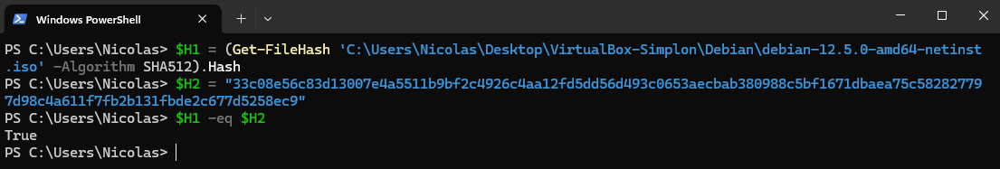
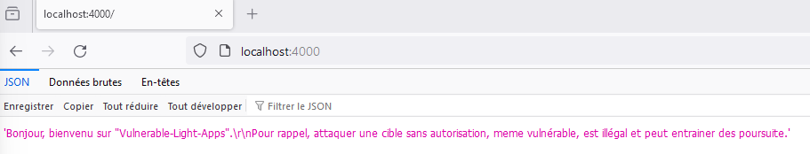
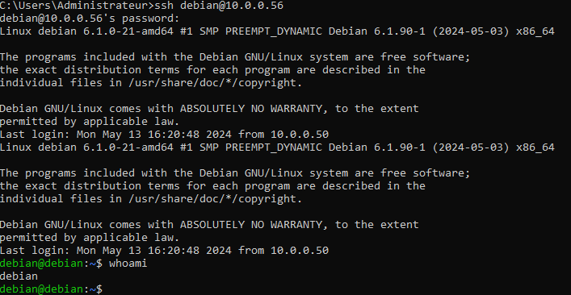
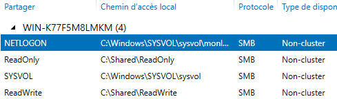
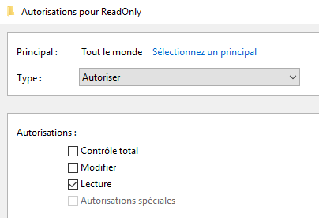

# Vérification des intégrités des images téléchargées avant l'installation

    

# Statut des services DNS et Web

    

    

# Connexions SSH et WinRM

    

    

# Permissions et statut du partage SMB

    

    

# Nombre d'utilisateurs contenus dans l'AD

    

